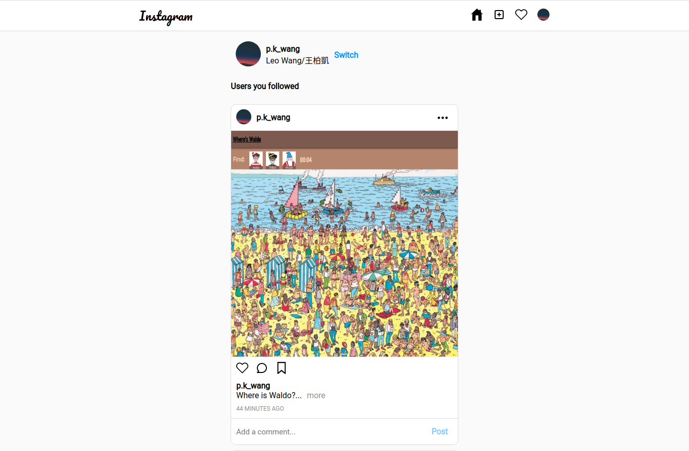
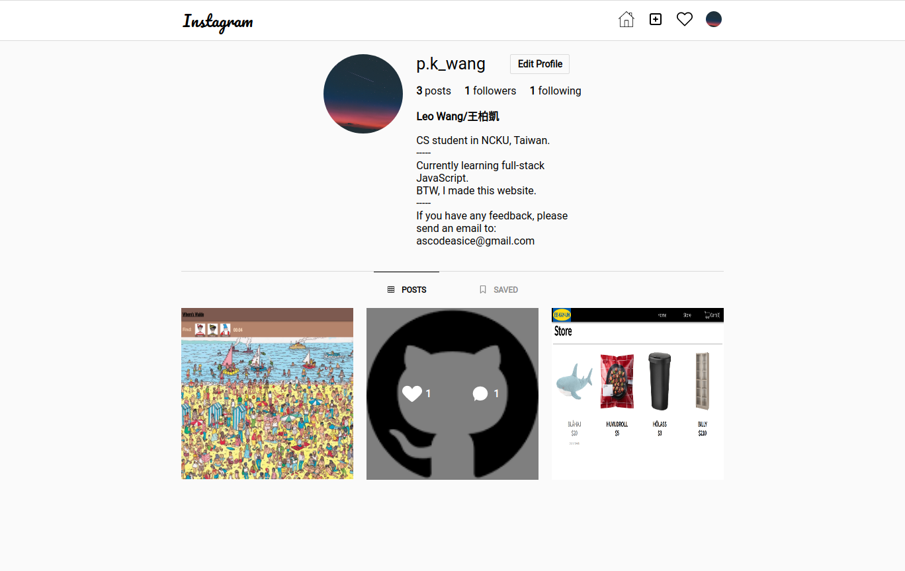

# insta-clone
A clone of the Instagram website, recreate its design and its main features.
You can:
- Share photos with/without text
- Edit your posts
- Follow/unfollow others
- Edit your own profile
- Like,save, comment on posts
- See other people follow you/ liked your posts

I spent about 55 hours to finish this project.
# Details
- Using react framework(create-react-app)
- Using context api for managing states
- Using firebase firestore for storing documents
- Using firebase storage for storing images
- Using firebase authentication(google)
- Using date-fns(npm module) for calculating time
# Might-happen Feature
- Hashtagging others
- Show visual feedback when there's new event 
- Show users liking this post
- Recommend users
- Better feed page algorithm
- Search for users or posts
- Report posts
- Report comments
- Edit comments
- Like comments
- Responsive design
- Post multiple photos/videos
# Result
## Posts

## Profile Page

# Link
[Live Preview](https://instagram-clone-9075e.firebaseapp.com/)